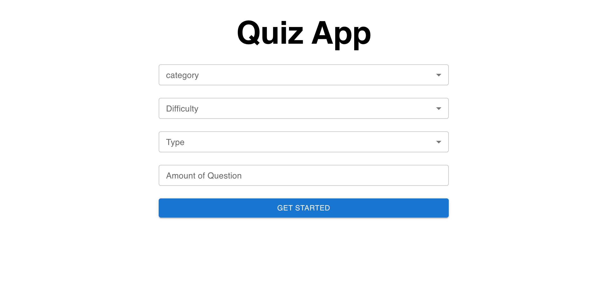
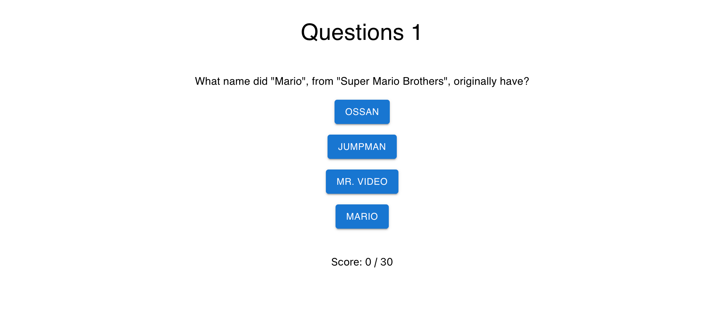

# React-Quiz-App 📚

### For clone this repository in your machine pest below link in your terminal 👇

```
git clone https://github.com/Milan-960/quiz-app.git
```

### Run below code to install dependency

```
npm install
```

### Run npm start to run the app

```
npm start
```

### Tecnologias which have been used 🔥

- [ReactJS](https://reactjs.org/)
- [Redux](https://redux.js.org/)
- [React Dom](https://reactjs.org/docs/react-dom.html)
- [MaterialUI](https://mui.com/)
- [React-Router-Dom](https://reactrouter.com/web/guides/quick-start)
- [Axios](https://axios-http.com/)
- [Trivia API](https://opentdb.com/api_config.php)

&nbsp;

&nbsp;
